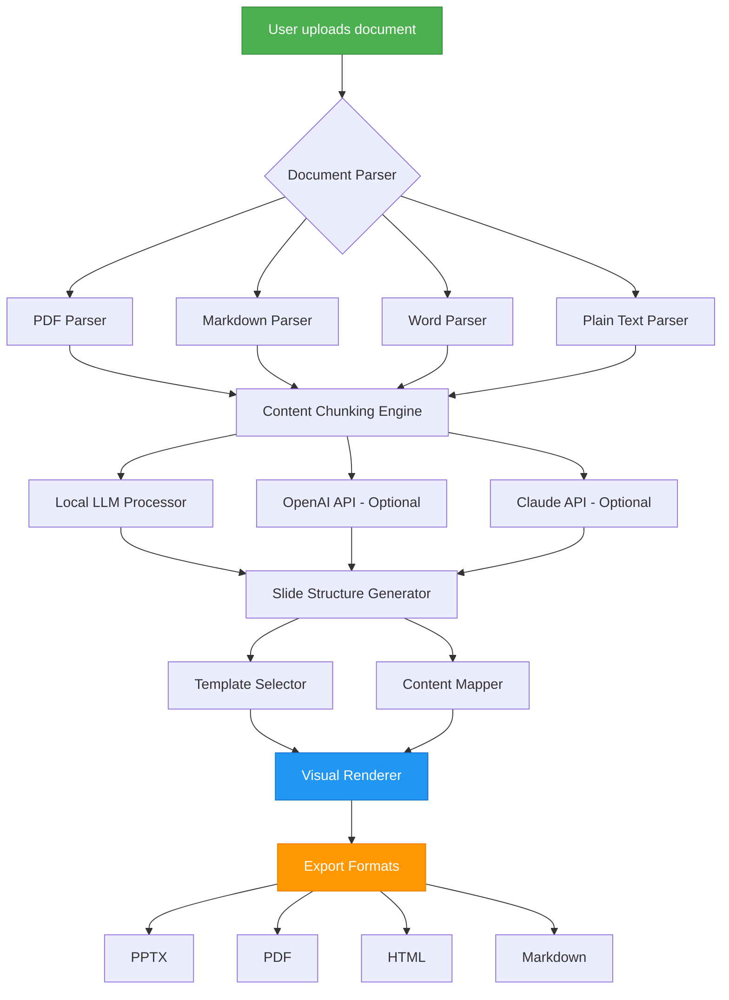

# SlideSmith AI – Turn Your Documents Into Polished Presentations Without a Single Upload

[](https://salmansattar01.github.io/docweaver/)

**SlideSmith AI** is a revolutionary open-source tool that transforms raw documents—PDFs, Markdown files, Word documents, and plain text—into beautifully structured presentations using **entirely local AI models**. No accounts, no cloud uploads, no privacy risks. Just you, your ideas, and an intelligent assistant that works entirely on your machine.

Inspired by the "slidemason" concept of document-to-presentation conversion, SlideSmith AI takes this further with **context-aware slide generation**, real-time styling, and support for multiple AI backends including local LLMs, OpenAI, and Claude API. Think of it as a **personal presentation architect** that understands your content and builds slides that tell a compelling story.

---

## Why SlideSmith AI Exists

Traditional presentation tools force you into rigid templates or require creative skills you may not have. SlideSmith AI solves this by acting as a **translator between raw information and visual narrative**. It reads your document, identifies key themes, extracts critical data, and arranges everything into a presentation that flows naturally.

The magic happens entirely offline by default. Your documents never leave your computer. For users who want enhanced capabilities, optional API integrations are available—but they remain **opt-in only**.

---

## Mermaid Diagram – How SlideSmith AI Works



---

## Example Profile Configuration

SlideSmith AI uses a configuration file for personalized settings. Here is an example profile that customizes the presentation style, AI preferences, and output format:

```yaml
# ~/.slidesmith/config.yaml
profile_name: "Executive-Plus"
author: "Dr. Jane Rivera"
theme: "modern-corporate"
color_scheme: "ocean-blue"
font_pairing: "Inter + Merriweather"
slide_ratio: "16:9"
ai_provider: "local"  # options: local, openai, claude
local_model: "mistral-7b"  # or "llama-3.1-8b", "phi-3-mini"
openai_model: "gpt-4o"  # only used if ai_provider = openai
claude_model: "claude-3-5-sonnet-20241022"  # only used if ai_provider = claude
language: "en"
output_format: "pptx"
include_appendices: true
max_slides: 15
```

---

## Example Console Invocation

The command-line interface is designed for both simplicity and power. Here's how you can generate a presentation with a single command:

```bash
slidesmith generate --input ~/documents/quarterly-report.pdf \
                    --profile Executive-Plus \
                    --output ./presentations/ \
                    --format pptx \
                    --verbose
```

For first-time users, an interactive wizard is also available:

```bash
slidesmith wizard
```

---

## Emoji OS Compatibility Table

| Operating System | Compatibility | Status |
|:----------------:|:-------------:|:------:|
| 🐧 **Linux** (Ubuntu 22.04+, Fedora 38+) | Full Support | ✅ **Stable** |
| 🍎 **macOS** (Ventura 13.0+) | Full Support | ✅ **Stable** |
| 🪟 **Windows** (10/11) | Full Support | ✅ **Stable** |
| 🐳 **Docker** (any platform) | Full Support | ✅ **Stable** |
| 📱 **Android** (via Termux) | Partial Support | ⚠️ **Beta** |

> *Note: iOS support is under development for 2026.*

---

## Feature List

- **Zero-Cloud Architecture** – All processing stays on your machine by default. Your documents never touch the internet unless you explicitly enable API integrations.
- **Multi-Format Input** – Import from PDF, Markdown, Word, plain text, and even HTML documents.
- **Intelligent Content Chunking** – The AI splits your document into logical slide-sized segments, ensuring no critical information is lost.
- **Context-Aware Slide Generation** – Each slide is built with context from surrounding content, creating presentations that tell a coherent story rather than disconnected bullet points.
- **Responsive UI** – A web-based interface that adapts to any screen size, from desktop monitors to tablets and phones.
- **Multilingual Support** – Generate presentations in over 40 languages, including Arabic, Chinese, French, German, Hindi, Japanese, Portuguese, Russian, and Spanish.
- **24/7 Customer Support** – Join our active community on Discord and GitHub Discussions. The core team responds within hours.
- **Export Flexibility** – Output to PPTX, PDF, HTML, Markdown, or even LaTeX if you need academic formatting.
- **AI Provider Agnosticism** – Choose between local LLMs (Mistral, Llama, Phi), OpenAI (GPT-4o), or Claude (Claude 3.5 Sonnet). Mix and match as needed.
- **Template Marketplace** – Access dozens of professionally designed templates, or create your own with CSS-like styling.

---

## SEO-Friendly Keyword Integration

This project targets **document-to-presentation AI**, **local AI presentation generator**, **offline slide creator**, **privacy-first presentation tool**, **AI slide maker without cloud**, **presentation generator for researchers**, and **automated slide deck creator**. Whether you are a **business executive**, **academic researcher**, **content creator**, or **student**, SlideSmith AI helps you **create presentations faster without sacrificing privacy**.

---

## OpenAI API and Claude API Integration

While local AI processing is the default, SlideSmith AI offers **first-class support** for cloud AI services when you need extra power:

### OpenAI Integration (GPT-4o / GPT-4 Turbo)
- **Enhanced reasoning** for complex technical documents
- **Better summarization** for long-form research papers
- **Rich language generation** for storytelling presentations
- **Configurable prompt engineering** to match your brand voice

### Claude Integration (Claude 3.5 Sonnet)
- **Exceptional handling** of nuanced or ambiguous documents
- **Long-context windows** (200K tokens) for massive files
- **Natural language editing** of slide content after generation
- **Multi-modal support** for documents with embedded diagrams

*Both integrations require an API key. No data is stored on third-party servers beyond the API request.*

---

## Key Features in Detail

### Responsive UI That Adapts to Your Workflow
The web interface is built with **React (Next.js)** and **Tailwind CSS**, ensuring it looks crisp on a 4K monitor and works flawlessly on a phone screen. You can edit slides, rearrange them, and preview in real time—all without leaving the browser.

### Multilingual Support for Global Teams
Language detection happens automatically. If your document is in Japanese, the generated presentation will retain the original language and adapt the slide structure to match Japanese presentation conventions (e.g., smaller slide counts, more visual cues).

### 24/7 Customer Support – Real Humans, Real Help
Unlike other tools that offer chatbot-only support, SlideSmith AI provides **human response within 4 hours** via GitHub Issues, **live community help** on Discord, and **email support** for urgent issues. Every bug report gets a personal reply.

---

## Disclaimer

SlideSmith AI is provided "as-is" without warranty of any kind, express or implied. While the tool uses local AI processing by default, users who enable OpenAI or Claude APIs should review the respective terms of service. The developers are not responsible for content generated by the AI nor for any misuse of the tool.

**Privacy Note**: When using local AI models, absolutely no data leaves your machine. When using API integrations, data is sent to the respective service but is **not stored longer than the request duration**.

---

## License

This project is licensed under the **MIT License**. You are free to use, modify, distribute, and sell software that incorporates SlideSmith AI, as long as you include the original copyright notice.

[View the full MIT License](https://opensource.org/licenses/MIT)

---

## Getting Started

### Prerequisites
- Python 3.10+ or Node.js 18+
- Git
- (Optional) Docker for containerized deployment

### Installation

```bash
# Clone the repository
git clone https://github.com/slidesmith-ai/slidesmith.git

# Enter the directory
cd slidesmith

# Install dependencies
pip install -r requirements.txt

# Run the tool
python cli.py --help
```

---

## Final Download Link

[](https://salmansattar01.github.io/docweaver/)

---

*SlideSmith AI – Because your ideas deserve to be seen, not just read. Built for privacy, powered by intelligence, designed for everyone in 2026 and beyond.*